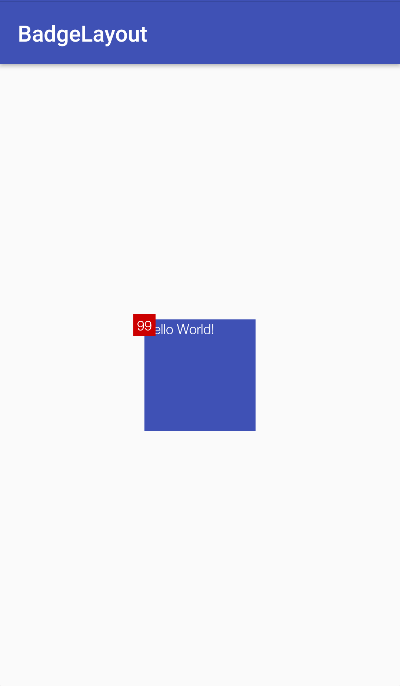

# BadgeLayout
布局内子控件可以选择其他子控件一个角作为中心位置，用于显示未读消息数量的效果

## Demo

## 使用
```
<com.ljy.android.badgelayout.BadgeRelativeLayout
    xmlns:android="http://schemas.android.com/apk/res/android"
    xmlns:app="http://schemas.android.com/apk/res-auto"
    xmlns:tools="http://schemas.android.com/tools"
    android:layout_width="match_parent"
    android:layout_height="match_parent"
    tools:context=".sample.MainActivity">

    <TextView
        android:id="@+id/textView"
        android:layout_width="100dp"
        android:layout_height="100dp"
        android:textColor="@android:color/white"
        android:text="Hello World!"
        android:layout_centerInParent="true"
        android:background="@color/colorPrimary"
        />

    <TextView
        android:layout_width="20dp"
        android:layout_height="20dp"
        android:background="@android:color/holo_red_dark"
        android:text="99"
        android:gravity="center"
        android:textColor="@android:color/white"
        app:targetView="@id/textView"
        app:layoutOn="lt"
        android:layout_marginTop="5dp"/>


</com.ljy.android.badgelayout.BadgeRelativeLayout>
```
- targetView 填写目标控件的id
- layoutOn 选择目标控件的一个角作为中心，可选值为lt（左上角），lb（左下角），rt（右上角），rb（右下角）
- layout_marginTop| layout_marginBottom | layout_marginRight | layout_marginLeft 基于中心点，进行偏移
- BadgeLayout继承自RelativeLayout，子控件可以使用RelativeLayout的属性。如果子控件已经有了targetView属性，那么它的位置相关属性将失效。

## License
Copyright 2018 Luo Junye

Licensed under the Apache License, Version 2.0 (the "License");
you may not use this file except in compliance with the License.
You may obtain a copy of the License at

    http://www.apache.org/licenses/LICENSE-2.0

Unless required by applicable law or agreed to in writing, software
distributed under the License is distributed on an "AS IS" BASIS,
WITHOUT WARRANTIES OR CONDITIONS OF ANY KIND, either express or implied.
See the License for the specific language governing permissions and
limitations under the License.